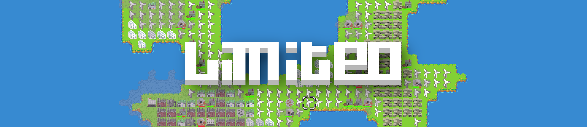
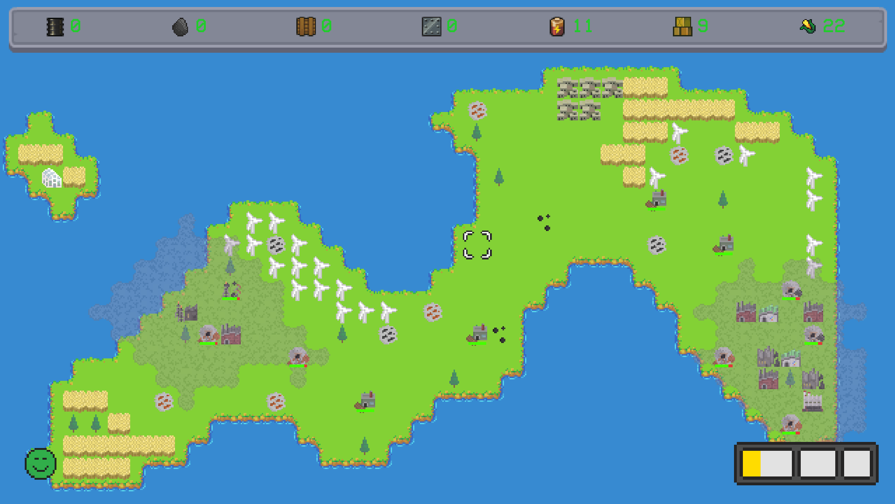
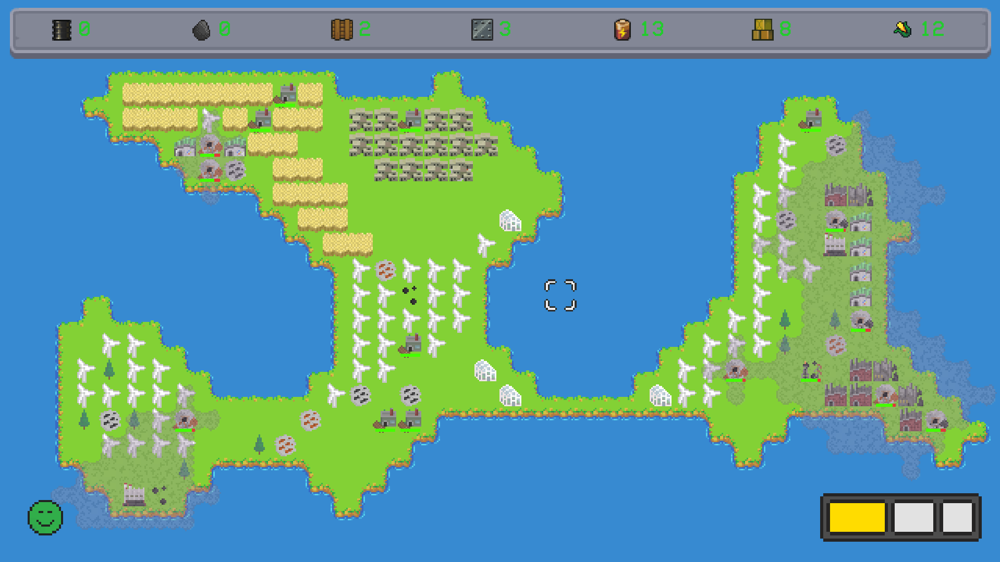
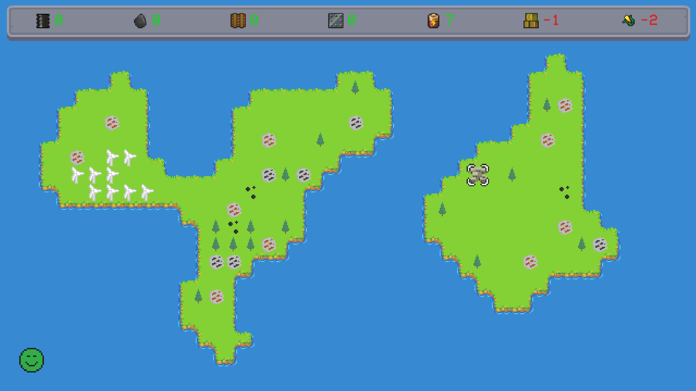

Projet de jeu vidéo 2D pour le cours [Développement de Jeux Vidéo 2D](https://applicationspub.unil.ch/interpub/noauth/php/Ud/ficheCours.php?v_enstyid=73011&v_langue=fr) donné par Isaac Pante au semestre d'Automne 2019 à l'[Université de Lausanne (UNIL)](https://www.unil.ch/index.html).

Le jeu a été publié et est téléchargeable sur [itch.io](https://sergenti.itch.io/limited) et est disponible pour Windows et MacOS.

# But de la médiation
Sensibiliser aux enjeux relatifs à l’environnement et aux ressources naturelles au travers d’un jeu de gestion où le joueur doit gérer une île aux ressources limitées, et la faire survivre le plus longtemps possible.

Le jeu s'adresse à tous les publics et n'aborde aucun thème sensible, outre notre politique climatique.

# Mécaniques de jeu
Le joueur intéragit avec le jeu principalement par la construction d'aménagements sur les cases de la carte. Son objectif est de fournir à la ville en constante expansion les ressources qu'elle nécessite.

Pour faire cela, il devra construire les bons aménagements et planifier l'exploitation de son île. Cependant, cette croissance infinie va finalement causer sa défaite à chaque partie.
Ainsi j'espère provoquer chez le joueur un questionnement du bienfondé de cette croissance qui semble être un des objectifs principaux de nos sociétés modernes.

La finitude des ressources naturelles est également mise en scène; certains aménagements les consomment, et certaines d'entre-elles ne se renouvellent pas, comme le charbon ou le pétrole. Par cette mécanique, le joueur sera amené à faire des choix stratégiques pour profiter des avantages qu'elles confèrent tout en ne les épuisant pas trop vite.

La pollution est une autre mécanique importante du jeu; elle réduit l'espace disponible. Dans *Limited*, l'espace est une ressource cruciale, mais limitée et non renouvelable, car le joueur ne peut pas détruire un aménagement une fois construit. Lorsque le joueur décide de construire un aménagement polluant, il va polluer les cases aux alentours, rendant impossible la production de nourriture et l'expansion de villes sur ces cases, ajoutant aux choix stratégiques que le joueur doit faire.

Pour permettre une rejouabilité plus grande, la carte du jeu est différente à chaque partie. Ces cartes sont générées par un [automate cellulaire](https://fr.wikipedia.org/wiki/Automate_cellulaire) similaire au [jeu de la vie](https://fr.wikipedia.org/wiki/Jeu_de_la_vie), mais avec des paramètres différents.

# Influences
Ce jeu est assez similaire en apparence à [Reactor Energy Sector Tycoon](https://play.google.com/store/apps/details?id=com.rsgapps.reactor&hl=en), un jeu incrémental dont le but est de remplir des îles d'aménagements pour produire le plus d'énergie possible et la vendre. La série des [Sid Meyer’s Civilization](https://en.wikipedia.org/wiki/Civilization_(video_game)) a également été importante, notamment pour son économie de ressources. Enfin, [Banished](https://en.wikipedia.org/wiki/Banished_(video_game)) m'aura sans doute influencé par ses carrières et mines qui elles aussi ne pouvaient être détruites et ne possédaient qu'une quantité limitée de ressources.

Des inspirations plus abstraites peuvent être tirées de jeux tels que [Papers, Please](https://en.wikipedia.org/wiki/Papers,_Please) ou encore [This War of Mine](https://en.wikipedia.org/wiki/This_War_of_Mine), dans lesquels la rareté des ressources crée un sentiment d'insécurité constant qui s'accorde aux propos du jeu.

# Captures d'écran

# Détails techniques
Le jeu a été réalisé avec le moteur de jeu **Unity**, en utilisant le langage de scriptage **C#**.

# Credits
### Design, Programmation:
Florian Rieder

### Art:
Sébastien Rieder

Florian Rieder

### Musiques:
Kyra Gedall

Florian Rieder

### Effets sonores:
Pedro Tomé

Certaines textures proviennent du site [OpenGameArt.org](https://opengameart.org/).
Certains effets sonores proviennent du site [FreeSound.org](https://freesound.org/).